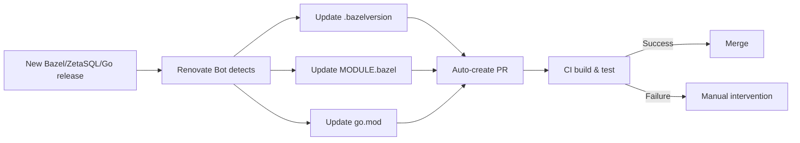

# zetasql-wasm Architecture Design Document

## Overview

This project is a library that enables Go applications to use Google's ZetaSQL (BigQuery/Spanner's SQL parser/analyzer) through WebAssembly (WASM).

### Goals

- **CGO-free**: Easy cross-compilation, pure Go binary
- **Automatic version management**: Fully automated updates of Bazel + ZetaSQL versions via Renovate Bot
- **Simple**: Easy to understand and maintain
- **Compatibility**: Provide migration path from goccy/go-zetasql

### Non-Goals

- Full ZetaSQL feature implementation (focus on parser/analyzer first)
- Real-time performance (slightly slower than native CGO)

## Architecture

### Overall Structure

```
┌─────────────┐
│  Go App     │
└──────┬──────┘
       │
       ↓ (Go API)
┌─────────────────┐
│ zetasql-wasm    │
│  (this library) │
└──────┬──────────┘
       │
       ↓ (wazero)
┌─────────────────┐
│  WASM Runtime   │
└──────┬──────────┘
       │
       ↓ (WASM)
┌─────────────────┐
│ ZetaSQL C++     │
│ (Compiled with  │
│  Emscripten)    │
└─────────────────┘
```

### Technology Stack

| Layer | Technology | Rationale |
|-------|------------|-----------|
| Go Runtime | wazero | Pure Go implementation, no CGO required, fast |
| WASM Compiler | Emscripten | C++ to WASM, essential for building ZetaSQL |
| Build System | Bazel (Bzlmod) + Docker | ZetaSQL's official build system |
| Dependency Manager | Renovate Bot | Fully automated updates for Bazel + ZetaSQL |

## Directory Structure

```
zetasql-wasm/
├── renovate.json               # Renovate Bot config (Bazel + ZetaSQL + Go auto-update)
├── go.mod                      # Go dependencies
├── go.sum
├── version.go                  # Version info (go:generate)
├── zetasql.go                  # Main API
├── parser.go                   # Parser implementation
├── analyzer.go                 # Analyzer implementation
├── docs/                       # Documentation
│   ├── ja/                    # Japanese documentation
│   │   ├── README.md
│   │   ├── architecture.md
│   │   ├── patches.md
│   │   ├── wasm-sdk-test-plan.md
│   │   └── wasi.md
│   └── en/                    # English documentation
│       ├── README.md
│       ├── architecture.md    # This file
│       ├── patches.md
│       ├── wasm-sdk-test-plan.md
│       └── wasi.md
├── wasm/                       # WASM build related (all in one place)
│   ├── build.sh               # Main build script (entry point)
│   ├── zetasql.wasm           # Built WASM binary
│   ├── .gitignore
│   └── assets/                # Build assets (Bazel workspace root)
│       ├── .bazelversion      # Bazel version (auto-updated by Renovate Bot)
│       ├── .bazelrc.local     # Bazel config file
│       ├── MODULE.bazel       # ZetaSQL dependency management (auto-updated by Renovate Bot)
│       ├── MODULE.bazel.lock  # Bazel lock file (reproducible builds)
│       ├── Dockerfile.emscripten # Docker environment definition
│       ├── build-internal.sh  # Build script inside Docker
│       └── bridge.cc          # C++ bridge code
└── README.md
```

### Directory Roles

#### `/` (Root)
- Go API implementation
- Version management files
- Code directly accessed by users

#### `/docs`
- Design documents (Japanese and English)
- Build instructions
- Migration guide

#### `/wasm`
- **All WASM-related content consolidated here**
- `build.sh`: Main build script (entry point)
- `zetasql.wasm`: Build output
- `.gitignore`: Git exclusion settings

#### `/wasm/assets`
- **Build assets (Bazel workspace root)**
- `.bazelversion`: Bazel version management (auto-updated by Renovate Bot)
- `.bazelrc.local`: Bazel config file (build optimization, output_base settings, etc.)
- `MODULE.bazel`: ZetaSQL dependency management (auto-updated by Renovate Bot)
- `MODULE.bazel.lock`: Bazel lock file (reproducible builds)
- `Dockerfile.emscripten`: Docker environment definition
- `build-internal.sh`: Build script inside Docker
- `bridge.cc`: C++ bridge code
- Not to be touched by non-developers

#### `/renovate.json`
- Renovate Bot config (automatically updates Bazel, ZetaSQL, and Go dependencies weekly)

## Version Management Strategy

### Fully Automated Management with Renovate Bot

**All dependencies are automatically updated by Renovate Bot**

Renovate Bot automatically monitors and updates the following files:

#### 1. Bazel Version (`.bazelversion`)

**wasm/.bazelversion**
```
8.5.0
```

Automatically updated by Renovate Bot's [Bazelisk manager](https://docs.renovatebot.com/modules/manager/bazelisk/).

#### 2. ZetaSQL Version (`MODULE.bazel`)

**wasm/MODULE.bazel**
```python
module(
    name = "zetasql-wasm",
    version = "0.0.1",
)

# ZetaSQL dependency (auto-updated by Renovate Bot)
bazel_dep(name = "zetasql", version = "2025.12.1")

# Actual ZetaSQL source (not registered in BCR)
git_override(
    module_name = "zetasql",
    remote = "https://github.com/google/zetasql.git",
    tag = "2025.12.1",
)
```

Automatically updated by Renovate Bot's [Bazel Module manager](https://docs.renovatebot.com/modules/manager/bazel-module/).

#### 3. Go Dependencies (`go.mod`)

**go.mod**
```go
module github.com/glassmonkey/zetasql-wasm

go 1.21

require github.com/tetratelabs/wazero v1.x.x
```

Automatically updated by Renovate Bot's [gomod manager](https://docs.renovatebot.com/modules/manager/gomod/).

### Renovate Bot Configuration

**renovate.json**
```json
{
  "$schema": "https://docs.renovatebot.com/renovate-schema.json",
  "extends": ["config:recommended"],
  "packageRules": [
    {
      "matchManagers": ["bazelisk"],
      "matchFileNames": ["wasm/.bazelversion"],
      "schedule": ["every weekend"]
    },
    {
      "matchManagers": ["bazel-module"],
      "matchFileNames": ["wasm/MODULE.bazel"],
      "schedule": ["every weekend"]
    },
    {
      "matchManagers": ["gomod"],
      "schedule": ["every weekend"]
    }
  ]
}
```

**Benefits**:
- ✅ **Fully automated**: All dependencies (Bazel, ZetaSQL, Go) automatically updated
- ✅ **Unified tool**: Single tool (Renovate Bot) manages all dependencies
- ✅ **Reproducibility**: Versions explicitly managed in each file
- ✅ **Standard**: Industry-standard dependency management tool
- ✅ **Flexibility**: Configurable update policies
- ✅ **Maintenance-free**: No manual version checking required

### Automated Version Update Flow



### When Manual Update is Required

If Renovate Bot's PR fails due to breaking changes:

```bash
# 1. Update Bazel version
vi wasm/.bazelversion
# 8.5.0 → 9.0.0

# 2. Update ZetaSQL version
vi wasm/MODULE.bazel
# bazel_dep(name = "zetasql", version = "2025.12.1") → "2026.01.1"
# git_override(..., tag = "2025.12.1") → "2026.01.1"

# 3. Build
cd wasm
./build.sh

# 4. Test
cd ..
go test ./...

# 5. Commit
git add wasm/.bazelversion wasm/MODULE.bazel
git commit -m "chore: update Bazel to 9.0.0 and ZetaSQL to 2026.01.1"
```

## WASM Build Strategy

### Build Approach

#### Phase 1: Early Development (Current)
- Developers build locally
- Unified environment with Docker
- Build executed via `go generate`

#### Phase 2: After Stabilization
- Automated build in CI/CD
- Distribution via GitHub Releases
- Users don't need to build

### Build Process


### ZetaSQL Source Acquisition

**Automatically fetched by Bazel**

Based on the `git_repository` definition in MODULE.bazel, Bazel automatically fetches and caches ZetaSQL:

```bash
# wasm/assets/build-internal.sh (excerpt)
# Bazel automatically downloads ZetaSQL from MODULE.bazel
bazel sync --only=zetasql

# Build (@zetasql is an external repository)
bazel build \
    @zetasql//zetasql/public:parser \
    @zetasql//zetasql/public:analyzer
```

**Benefits of Bazel dependency management**:
- ✅ **Fully automated**: No manual git clone required
- ✅ **Reproducibility**: Completely fixed by MODULE.bazel.lock
- ✅ **Caching**: Automatically managed by Bazel
- ✅ **Version management**: Automatically updated by Dependabot
- ✅ **Standard**: Follows ZetaSQL's official build method

### Emscripten Settings

- **Optimization level**: `-O3` (balance between size and performance)
- **Exported functions**: parse_statement, analyze_statement
- **Modularization**: MODULARIZE=1 (support for multiple instances)

### Build Artifacts

- `wasm/zetasql.wasm`: WASM binary for embedding
- Size target: 10-30MB (depends on dependencies)

## Go API Design

### Basic Principles

- **Simple**: Similar API to goccy/go-zetasql
- **Type-safe**: Leverage Go's type system
- **Error handling**: Clear error messages
- **Context**: Cancellation support with context.Context

### Main APIs

```go
// Create parser
parser, err := zetasql.NewParser(ctx)

// Parse SQL
stmt, err := parser.ParseStatement(ctx, "SELECT * FROM table")

// Create analyzer (with catalog)
analyzer, err := zetasql.NewAnalyzer(ctx, catalog)

// Analyze SQL
output, err := analyzer.AnalyzeStatement(ctx, "SELECT * FROM table")

// Resource cleanup
defer parser.Close(ctx)
```

## Comparison with Reference Implementation

### goccy/go-zetasql

| Item | goccy/go-zetasql | zetasql-wasm |
|------|------------------|--------------|
| Binding | CGO | WASM (wazero) |
| Cross-compilation | Difficult | Easy |
| Build time | Long (10-30 min) | Long (first time only) |
| Runtime performance | Fast | Slightly slower |
| Binary size | Small | Larger (includes WASM) |
| Dependencies | C++ compiler required | Not required |
| Maintainability | Complex | Simple |

### Migration Path

Assuming migration from goccy/go-zetasql, API compatibility is maintained:

```go
// Before (goccy/go-zetasql)
import "github.com/goccy/go-zetasql"

// After (zetasql-wasm)
import "github.com/glassmonkey/zetasql-wasm"
// API is mostly the same
```

## Constraints

### Current Constraints

1. **Feature scope**: Parser/Analyzer only (Reference Impl is out of scope)
2. **Performance**: 10-30% slower than native CGO
3. **WASM size**: 10-30MB (not suitable for network distribution)
4. **Memory management**: WASM memory overhead

### Future Improvements

- Gradual feature additions
- WASM size optimization
- Performance tuning
- Caching mechanism

## Security Considerations

### WASM Sandbox

- wazero executes WASM in a sandbox
- Restricted access to host system
- Memory isolation

### Dependencies

- ZetaSQL is official from Google (high reliability)
- wazero is a CNCF project (audited)
- Emscripten is widely used

## Performance Goals

### Benchmark Criteria

- **Small queries** (<100 characters): < 10ms
- **Medium queries** (100-1000 characters): < 50ms
- **Large queries** (>1000 characters): < 200ms

※ 1.1-1.3x of native CGO is acceptable

### Optimization Points

1. WASM module reuse
2. Reduce memory allocation
3. Minimize string copying

## Testing Strategy

### Test Levels

1. **Unit tests**: Go API
2. **Integration tests**: WASM integration
3. **Compliance tests**: Use ZetaSQL official tests
4. **Performance tests**: Benchmarks

### CI/CD

- GitHub Actions
- Multiple Go versions (1.21+)
- Multiple OS (Linux, macOS, Windows)

## License

- zetasql-wasm: Apache 2.0
- ZetaSQL: Apache 2.0
- wazero: Apache 2.0
- Emscripten: MIT/UIUC

Be careful about license inheritance from dependent libraries.

## References

- [ZetaSQL](https://github.com/google/zetasql)
- [goccy/go-zetasql](https://github.com/goccy/go-zetasql)
- [wazero](https://wazero.io/)
- [Emscripten](https://emscripten.org/)
- [WebAssembly](https://webassembly.org/)
- [Bazel Bzlmod](https://bazel.build/external/overview)
- [Renovate Bot](https://docs.renovatebot.com/)
- [Renovate Bot - Bazelisk Manager](https://docs.renovatebot.com/modules/manager/bazelisk/)
- [Renovate Bot - Bazel Module Manager](https://docs.renovatebot.com/modules/manager/bazel-module/)

---

**Last Updated**: 2026-01-08
**Version**: 1.0.0
**Status**: Draft
