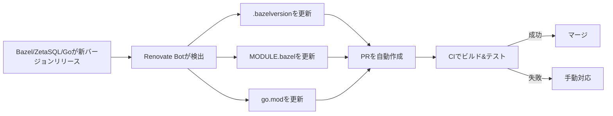

# zetasql-wasm アーキテクチャ設計書

## 概要

このプロジェクトは、GoogleのZetaSQL（BigQuery/SpannerのSQLパーサー/アナライザー）をWebAssembly（WASM）経由でGoから利用できるようにするライブラリです。

### 目標

- **cgo不要**: クロスコンパイル容易、純粋なGoバイナリ
- **自動バージョン管理**: Renovate BotによるBazel + ZetaSQLバージョンの完全自動更新
- **シンプル**: 理解しやすく、メンテナンス性の高い構成
- **互換性**: goccy/go-zetasqlからの移行パスを提供

### 非目標

- ZetaSQLの全機能実装（まずはparser/analyzerに注力）
- リアルタイム性能（ネイティブcgoより若干劣る）

## アーキテクチャ

### 全体構成

```
┌─────────────┐
│  Go アプリ   │
└──────┬──────┘
       │
       ↓ (Go API)
┌─────────────────┐
│ zetasql-wasm    │
│  (このライブラリ) │
└──────┬──────────┘
       │
       ↓ (wazero)
┌─────────────────┐
│  WASM Runtime   │
└──────┬──────────┘
       │
       ↓ (WASM)
┌─────────────────┐
│ ZetaSQL C++     │
│ (Emscriptenで   │
│  コンパイル)     │
└─────────────────┘
```

### 技術スタック

| レイヤー | 技術 | 理由 |
|---------|------|------|
| Go Runtime | wazero | Pure Go実装、cgo不要、高速 |
| WASM Compiler | Emscripten | C++→WASM、ZetaSQLのビルドに必須 |
| Build System | Bazel (Bzlmod) + Docker | ZetaSQLの公式ビルドシステム |
| Dependency Manager | Renovate Bot | Bazel本体 + ZetaSQLの完全自動更新 |

## ディレクトリ構成

```
zetasql-wasm/
├── renovate.json               # Renovate Bot設定（Bazel + ZetaSQL + Go自動更新）
├── go.mod                      # Go依存関係
├── go.sum
├── version.go                  # バージョン情報（go:generate）
├── zetasql.go                  # メインAPI
├── parser.go                   # Parser実装
├── analyzer.go                 # Analyzer実装
├── docs/                       # ドキュメント
│   ├── README.md              # ドキュメント目次
│   ├── architecture.md         # このファイル（設計書）
│   ├── build.md               # ビルド手順（TODO）
│   └── migration.md           # 移行ガイド（TODO）
├── wasm/                       # WASMビルド関連（全てここに集約）
│   ├── build.sh               # ビルドメインスクリプト（エントリーポイント）
│   ├── zetasql.wasm           # ビルド済みWASMバイナリ
│   ├── .gitignore
│   └── assets/                # ビルド素材（Bazelワークスペースルート）
│       ├── .bazelversion      # Bazelバージョン（Renovate Botが自動更新）
│       ├── .bazelrc.local     # Bazel設定ファイル
│       ├── MODULE.bazel       # ZetaSQL依存管理（Renovate Botが自動更新）
│       ├── MODULE.bazel.lock  # Bazelロックファイル（再現性の高いビルド）
│       ├── Dockerfile.emscripten # Docker環境定義
│       ├── build-internal.sh  # Docker内ビルドスクリプト
│       └── bridge.cc          # C++ブリッジコード
└── README.md
```

### ディレクトリの役割

#### `/` (ルート)
- Go APIの実装
- バージョン管理ファイル
- ユーザーが直接触れるコード

#### `/docs`
- 設計ドキュメント
- ビルド手順
- 移行ガイド

#### `/wasm`
- **WASM関連を全て集約**
- `build.sh`: ビルドメインスクリプト（エントリーポイント）
- `zetasql.wasm`: ビルド成果物
- `.gitignore`: Git除外設定

#### `/wasm/assets`
- **ビルド素材（Bazelワークスペースルート）**
- `.bazelversion`: Bazelバージョン管理（Renovate Botが自動更新）
- `.bazelrc.local`: Bazel設定ファイル（ビルド最適化、output_base設定等）
- `MODULE.bazel`: ZetaSQL依存管理（Renovate Botが自動更新）
- `MODULE.bazel.lock`: Bazelロックファイル（再現性の高いビルド）
- `Dockerfile.emscripten`: Docker環境定義
- `build-internal.sh`: Docker内ビルドスクリプト
- `bridge.cc`: C++ブリッジコード
- 開発者以外は触らない

#### `/renovate.json`
- Renovate Bot設定（Bazel本体、ZetaSQL、Goの依存関係を週次で自動更新）

## バージョン管理方針

### Renovate Botによる完全自動管理

**すべての依存関係をRenovate Botで自動更新**

Renovate Botは以下のファイルを自動的に監視・更新します：

#### 1. Bazelバージョン (`.bazelversion`)

**wasm/.bazelversion**
```
8.5.0
```

Renovate Botの[Bazelisk manager](https://docs.renovatebot.com/modules/manager/bazelisk/)が自動更新します。

#### 2. ZetaSQLバージョン (`MODULE.bazel`)

**wasm/MODULE.bazel**
```python
module(
    name = "zetasql-wasm",
    version = "0.0.1",
)

# ZetaSQL依存（Renovate Botが自動更新）
bazel_dep(name = "zetasql", version = "2025.12.1")

# ZetaSQLの実際の取得先（BCR未登録のため）
git_override(
    module_name = "zetasql",
    remote = "https://github.com/google/zetasql.git",
    tag = "2025.12.1",
)
```

Renovate Botの[Bazel Module manager](https://docs.renovatebot.com/modules/manager/bazel-module/)が自動更新します。

#### 3. Go依存関係 (`go.mod`)

**go.mod**
```go
module github.com/glassmonkey/zetasql-wasm

go 1.21

require github.com/tetratelabs/wazero v1.x.x
```

Renovate Botの[gomod manager](https://docs.renovatebot.com/modules/manager/gomod/)が自動更新します。

### Renovate Bot設定

**renovate.json**
```json
{
  "$schema": "https://docs.renovatebot.com/renovate-schema.json",
  "extends": ["config:recommended"],
  "packageRules": [
    {
      "matchManagers": ["bazelisk"],
      "matchFileNames": ["wasm/.bazelversion"],
      "schedule": ["every weekend"]
    },
    {
      "matchManagers": ["bazel-module"],
      "matchFileNames": ["wasm/MODULE.bazel"],
      "schedule": ["every weekend"]
    },
    {
      "matchManagers": ["gomod"],
      "schedule": ["every weekend"]
    }
  ]
}
```

**メリット**:
- ✅ **完全自動**: Bazel本体、ZetaSQL、Goすべてを自動更新
- ✅ **統一ツール**: Renovate Bot 1つですべての依存関係を管理
- ✅ **再現性**: 各ファイルでバージョンを明示的に管理
- ✅ **標準的**: 業界標準の依存管理ツール
- ✅ **柔軟性**: 細かい更新ポリシーを設定可能
- ✅ **メンテナンス不要**: 手動でのバージョン確認が不要

### バージョン更新フロー（自動）



### 手動更新が必要な場合

破壊的変更などでRenovate BotのPRが失敗した場合：

```bash
# 1. Bazelバージョンを更新
vi wasm/.bazelversion
# 8.5.0 → 9.0.0

# 2. ZetaSQLバージョンを更新
vi wasm/MODULE.bazel
# bazel_dep(name = "zetasql", version = "2025.12.1") → "2026.01.1"
# git_override(..., tag = "2025.12.1") → "2026.01.1"

# 3. ビルド
cd wasm
./build.sh

# 4. テスト
cd ..
go test ./...

# 5. コミット
git add wasm/.bazelversion wasm/MODULE.bazel
git commit -m "chore: update Bazel to 9.0.0 and ZetaSQL to 2026.01.1"
```

## WASMビルド方針

### ビルド戦略

#### Phase 1: 開発初期（現在）
- 開発者がローカルでビルド
- Dockerで環境を統一
- `go generate`でビルド実行

#### Phase 2: 安定後
- CI/CDで自動ビルド
- GitHub Releasesで配布
- ユーザーはビルド不要

### ビルドプロセス


### ZetaSQLソースの取得

**Bazelが自動的に取得**

MODULE.bazelの`git_repository`定義に基づき、Bazelが自動的にZetaSQLを取得・キャッシュします：

```bash
# wasm/assets/build-internal.sh（抜粋）
# BazelがMODULE.bazelからZetaSQLを自動的にダウンロード
bazel sync --only=zetasql

# ビルド（@zetasqlは外部リポジトリ）
bazel build \
    @zetasql//zetasql/public:parser \
    @zetasql//zetasql/public:analyzer
```

**Bazel依存管理のメリット**:
- ✅ **完全自動**: 手動git cloneが不要
- ✅ **再現性**: MODULE.bazel.lockで完全に固定
- ✅ **キャッシュ**: Bazelが自動的に管理
- ✅ **バージョン管理**: Dependabotが自動更新
- ✅ **標準的**: ZetaSQLの公式ビルド方法に沿う

### Emscripten設定

- **最適化レベル**: `-O3` (サイズとパフォーマンスのバランス)
- **エクスポート関数**: parse_statement, analyze_statement
- **モジュール化**: MODULARIZE=1（複数インスタンス対応）

### ビルド成果物

- `wasm/zetasql.wasm`: 埋め込み用WASMバイナリ
- サイズ目標: 10-30MB（依存関係による）

## Go API設計

### 基本方針

- **シンプル**: goccy/go-zetasqlと類似のAPI
- **型安全**: Goの型システムを活用
- **エラー処理**: 明確なエラーメッセージ
- **コンテキスト**: context.Contextでキャンセル対応

### 主要API

```go
// Parser作成
parser, err := zetasql.NewParser(ctx)

// SQLパース
stmt, err := parser.ParseStatement(ctx, "SELECT * FROM table")

// Analyzer作成（カタログ付き）
analyzer, err := zetasql.NewAnalyzer(ctx, catalog)

// SQL分析
output, err := analyzer.AnalyzeStatement(ctx, "SELECT * FROM table")

// リソース解放
defer parser.Close(ctx)
```

## 参考実装との比較

### goccy/go-zetasql

| 項目 | goccy/go-zetasql | zetasql-wasm |
|------|------------------|--------------|
| バインディング | cgo | WASM (wazero) |
| クロスコンパイル | 困難 | 容易 |
| ビルド時間 | 長い（10-30分） | 長い（初回のみ） |
| ランタイム性能 | 高速 | やや低速 |
| バイナリサイズ | 小 | やや大（WASM含む） |
| 依存関係 | C++コンパイラ必須 | 不要 |
| 保守性 | 複雑 | シンプル |

### 移行パス

goccy/go-zetasqlからの移行を想定し、APIの互換性を保つ：

```go
// Before (goccy/go-zetasql)
import "github.com/goccy/go-zetasql"

// After (zetasql-wasm)
import "github.com/yourname/zetasql-wasm"
// API はほぼ同じ
```

## 制約事項

### 現在の制約

1. **機能範囲**: Parser/Analyzerのみ（Reference Implは対象外）
2. **パフォーマンス**: ネイティブcgoより10-30%遅い
3. **WASMサイズ**: 10-30MB（ネットワーク配信には不向き）
4. **メモリ管理**: WASMメモリのオーバーヘッド

### 将来の改善

- 機能の段階的追加
- WASMサイズ最適化
- パフォーマンスチューニング
- キャッシング機構

## セキュリティ考慮事項

### WASMサンドボックス

- wazeroはWASMをサンドボックス実行
- ホストシステムへのアクセス制限
- メモリ分離

### 依存関係

- ZetaSQLはGoogle公式（信頼性高）
- wazeroはCNCFプロジェクト（監査済み）
- Emscriptenは広く利用されている

## パフォーマンス目標

### ベンチマーク基準

- **小規模クエリ** (<100文字): < 10ms
- **中規模クエリ** (100-1000文字): < 50ms
- **大規模クエリ** (>1000文字): < 200ms

※ネイティブcgoの1.1-1.3倍を許容

### 最適化ポイント

1. WASMモジュールの再利用
2. メモリアロケーション削減
3. 文字列コピー最小化

## テスト方針

### テストレベル

1. **ユニットテスト**: Go API
2. **統合テスト**: WASM連携
3. **コンプライアンステスト**: ZetaSQL公式テスト利用
4. **パフォーマンステスト**: ベンチマーク

### CI/CD

- GitHub Actions
- 複数Go バージョン（1.21+）
- 複数OS（Linux, macOS, Windows）

## ライセンス

- zetasql-wasm: Apache 2.0
- ZetaSQL: Apache 2.0
- wazero: Apache 2.0
- Emscripten: MIT/UIUC

依存ライブラリのライセンス継承に注意。

## 参考資料

- [ZetaSQL](https://github.com/google/zetasql)
- [goccy/go-zetasql](https://github.com/goccy/go-zetasql)
- [wazero](https://wazero.io/)
- [Emscripten](https://emscripten.org/)
- [WebAssembly](https://webassembly.org/)
- [Bazel Bzlmod](https://bazel.build/external/overview)
- [Renovate Bot](https://docs.renovatebot.com/)
- [Renovate Bot - Bazelisk Manager](https://docs.renovatebot.com/modules/manager/bazelisk/)
- [Renovate Bot - Bazel Module Manager](https://docs.renovatebot.com/modules/manager/bazel-module/)

---

**Last Updated**: 2026-01-06
**Version**: 1.0.0
**Status**: Draft
